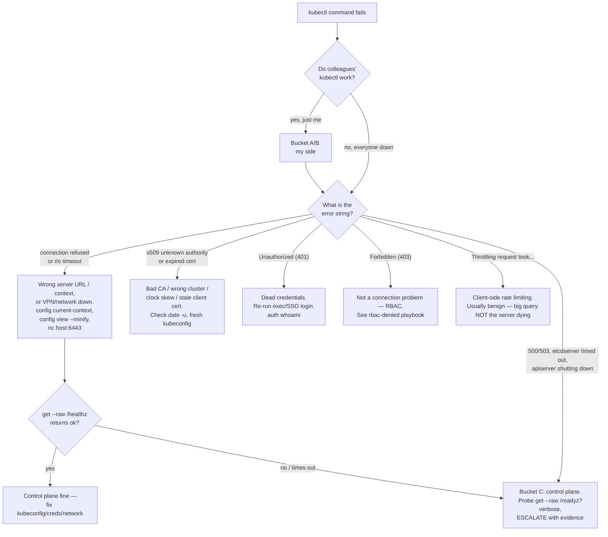

**Symptom:** kubectl itself doesn't work. Not "my app is down" — the tool. Commands hang, refuse to connect, complain about certificates, or bounce you as unauthorized. This is a different animal from every other playbook on this site: those assume kubectl works and something *behind* it is broken. Here, the client-to-control-plane conversation itself has failed, so you can't even start triaging your workload until you fix it.

The whole game is one fast decision. A broken kubectl is exactly one of three things:

- **(A) Your side — kubeconfig, context, credentials, or auth plugin.** Wrong server URL, wrong cluster selected, expired token, stale client cert. *You fix this.*
- **(B) The network path to the API endpoint.** VPN down, DNS, firewall, or the load balancer in front of the apiserver unreachable from where you sit. *Usually you fix your half; the LB itself is platform's.*
- **(C) The API server / control plane itself.** etcd, the apiserver process, or control-plane certs are unhealthy. *This is the platform team's problem — escalate, don't poke.*

Reading the literal error tells you which bucket you're in in about ten seconds. Do that first.

## The single most useful discriminator: is it just you?

Before decoding anything, answer one question, because it collapses the whole tree:

**Can other people reach the cluster right now, and you can't?** Then it's bucket (A) or (B) — *your* kubeconfig, *your* context, *your* VPN, *your* creds. The control plane is fine by definition if a colleague's kubectl works. Ask in chat before you file a control-plane ticket; "works for me" from a teammate saves you from escalating your own expired token.

If *everyone* is down and neighboring teams are affected too, you're likely in bucket (C) and the platform team probably already knows — but confirm with the checks below so your escalation carries evidence, not vibes.

## `Unable to connect to the server` — connection refused / timeout

```console
Unable to connect to the server: dial tcp 10.0.0.10:6443: connect: connection refused
```

or

```console
Unable to connect to the server: dial tcp 10.0.0.10:6443: i/o timeout
```

**What it means:** kubectl resolved a server address and tried to open a TCP connection to it — and got a slammed door (`connection refused`) or silence (`i/o timeout`). This is buckets (A) and (B) far more often than (C). The address it dialed is printed right there; check whether it's even the right one.

The refused-vs-timeout distinction is the same signal as anywhere else on the network:

- **`connection refused`** — something answered and said no (RST). Usually the *wrong* address — you're pointed at a host/port where nothing is listening (stale kubeconfig, a local `127.0.0.1:6443` from a dead kind/minikube, a wrong context).
- **`i/o timeout`** — packets vanished into the void. Firewall, VPN down, or a genuinely unreachable endpoint. The classic corporate cause: your VPN dropped and the apiserver lives on a private network.

Checks, cheapest first:

```bash
kubectl config current-context          # am I even pointed at the cluster I think I am?
kubectl config view --minify            # what SERVER URL is this context using?
kubectl cluster-info                    # prints the control-plane URL it's targeting
```

Then test the path *without* kubectl, so you separate (A) from (B):

```bash
# Is the VPN up / is the endpoint even reachable? (host:port from the server URL above)
nc -vz api.cluster.example.com 6443     # or: curl -k -sS https://api.cluster.example.com:6443/healthz
```

- Wrong server URL or context → bucket (A). Switch context (`kubectl config use-context <name>`) or get a correct kubeconfig.
- Right URL but `nc`/`curl` also can't reach it, *and colleagues can* → bucket (B), your side: VPN, DNS, firewall. Reconnect the VPN and retry.
- Right URL, nobody can reach it, endpoint refuses/times out for everyone → possible bucket (C) or the apiserver LB is down. Escalate with the URL, the exact error, and "cluster-wide."

:::note[`curl .../healthz` returning `ok` while kubectl fails is a huge clue]
If a plain `curl -k https://<apiserver>:6443/healthz` returns `ok` but `kubectl` still can't connect, the network path and the server are both fine — the problem is in your kubeconfig or credentials (buckets A). That single test rules out half the tree.
:::

## `x509: certificate signed by unknown authority` / `certificate has expired`

```console
Unable to connect to the server: x509: certificate signed by unknown authority
```

```console
Unable to connect to the server: x509: certificate has expired or is not yet valid: current time ... is after ...
```

**What it means:** kubectl reached the apiserver's TLS endpoint but *refused to trust it*. The TCP path is fine — this is purely a certificate-validation failure. Overwhelmingly bucket (A): the wrong CA bundle in your kubeconfig, a wrong cluster entry, or a clock problem. It is almost never the server's cert being "broken" (that would break everyone at once and is platform-owned).

The usual causes, in order of likelihood:

- **Wrong cluster / stale kubeconfig.** Your `certificate-authority-data` doesn't match the cert the apiserver now presents — commonly after the cluster was rebuilt or you're pointed at a different endpoint than the CA belongs to. Fix: get a fresh kubeconfig from the platform team.
- **Clock skew.** `certificate has expired or is not yet valid` with a *future* "not yet valid" boundary usually means *your machine's clock is wrong*, not the cert. Check it:

  ```bash
  date -u                                 # is your clock actually correct (UTC)?
  ```

  A laptop that slept through a timezone change or has NTP disabled will reject perfectly valid certs. Fix the clock, not the cert.
- **Expired client cert.** Some kubeconfigs embed a client certificate (`client-certificate-data`) with its own expiry. If it's aged out, you need a new kubeconfig; you can't renew it yourself.

Inspect what your kubeconfig is presenting without decoding base64 by hand:

```bash
kubectl config view --minify              # look for certificate-authority-data / client-certificate-data / server
```

:::caution[Don't reach for `--insecure-skip-tls-verify`]
It'll make the x509 error vanish and feels like a fix. It isn't — you've just turned off the check that was telling you you're pointed at the wrong cluster (or being MITM'd). Use it only for a throwaway diagnostic, never in a saved context.
:::

## `You must be logged in to the server (Unauthorized)` — 401, not 403

```console
error: You must be logged in to the server (Unauthorized)
```

**What it means:** the apiserver received your request, completed TLS, and could not figure out *who you are* — your credentials are missing, invalid, or expired. This is authe**n**tication (401), and it is a different failure from authorization (403). Getting this distinction right saves you from filing the wrong ticket.

**401 Unauthorized = "I don't know who you are."** A credential problem — bucket (A). Typical causes:

- An **exec-plugin / cloud auth token expired.** Many kubeconfigs authenticate via an `exec` credential plugin (cloud CLIs, OIDC helpers) that mints a short-lived token. When it can't refresh — your cloud CLI session logged out, SSO expired — every kubectl call 401s. Fix: re-run the login for whatever your kubeconfig's `exec` block calls (re-authenticate to your cloud/SSO), then retry.
- An expired or revoked bearer **token** hardcoded in the kubeconfig.
- The wrong context entirely, pointed at a cluster your current identity has no credential for.

**403 Forbidden = "I know who you are, and you can't do that."** That's RBAC — a *different* playbook. If your error says `Forbidden` and names a verb/resource, you're authenticated fine; go to [RBAC Denied (Forbidden)](/troubleshooting/rbac-denied/). Do not confuse the two: 401 → fix your login; 403 → request access.

Quick confirmation that you're authenticating (or not):

```bash
kubectl auth whoami                       # who does the server think I am? (401s if creds are dead)
```

## `Throttling request took 1.xxs` — client-side, and usually benign

```console
I0708 14:03:11.234567   12345 request.go:697] Throttling request took 1.140302s, request: GET:https://.../apis/...
```

**What it means:** *this is not the server dying.* This message comes from **client-go's own rate limiter** inside kubectl (you typically only see it with `-v=2` or higher verbosity, or from a controller's logs). kubectl throttles *itself* to a default QPS/burst so it doesn't hammer the apiserver; when a command needs to make many API calls in a burst — a big `get all`, a plugin walking every resource type, `kubectl get ... -o` across a huge namespace — it queues its own requests and logs the wait.

The trap: people see "Throttling" plus a slow command and conclude the apiserver is overloaded or failing, then escalate. It's the opposite — it's *your client* deliberately pacing itself. The server may be perfectly healthy.

What to actually do:

- If a command is *slow but succeeding* and you see this at high verbosity → it's benign. It's a sign your query is large (touching many resource types), not that anything is broken.
- If it's a script or controller you own making thousands of calls, that's a design smell — narrow the query (label selectors, `-o` field selection, target specific resource types) rather than raising QPS blindly.
- It tells you nothing about buckets (B) or (C). Don't include it as "evidence of a control-plane problem" in an escalation.

## Control-plane symptoms — bucket (C), escalate

These say the request *got to a working apiserver-or-etcd and the server itself failed*. This is platform-owned. You cannot fix it from your laptop, and poking harder won't help.

```console
Error from server: etcdserver: request timed out
```

```console
Error from server (ServiceUnavailable): the server is currently unable to handle the request
```

```console
Error from server (InternalError): an error on the server ("apiserver is shutting down") has prevented the request from succeeding
```

```console
Error from server (Timeout): the server was unable to return a response in the time allotted, but may still be processing the requested operation
```

**What they mean:**

- **`etcdserver: request timed out`** — the apiserver is up but its backing store (etcd) isn't answering in time. etcd is the heart of the control plane; this is a serious platform incident.
- **500 `InternalError` / `apiserver is shutting down`** — the apiserver process is unhealthy or mid-restart (a rolling control-plane upgrade, a crash). Often transient during maintenance.
- **503 `ServiceUnavailable`** — the apiserver (or the LB in front of it) has no healthy backend to serve you. If reads work but writes 503, or it flaps, that's control-plane instability.
- **`the server was unable to return a response in the time allotted`** — the apiserver accepted the request but timed out serving it, frequently downstream of etcd being slow or a specific overloaded API path.

Unlike a `connection refused`, these prove you *reached a live apiserver* — the failure is inside the control plane. Confirm it's cluster-wide, capture evidence, escalate. See the health-probe section next for the read-only checks that make your ticket credible.

## Read-only control-plane health probes you CAN hit

The apiserver exposes health endpoints you can query with plain kubectl — no special permissions, no writes, safe during an incident. These are real, stable endpoints ([documented on kubernetes.io](https://kubernetes.io/docs/reference/using-api/health-checks/)):

```bash
kubectl get --raw='/healthz'      # overall apiserver health — prints "ok" when healthy
kubectl get --raw='/livez'        # is the apiserver process alive?
kubectl get --raw='/readyz'       # is it ready to serve requests? (readiness, incl. etcd)
```

Add `?verbose` to see the individual checks (each subsystem, including etcd, listed pass/fail):

```bash
kubectl get --raw='/readyz?verbose'
```

Reading the results:

- **All three return `ok`** → the control plane is healthy. Your problem is bucket (A) or (B) — go back to kubeconfig/context/network. (A healthy `/healthz` with a failing normal command is a strong "it's your side" signal.)
- **`/livez` ok but `/readyz` failing** → the apiserver is alive but not ready — commonly etcd unhealthy or a subsystem still starting. Bucket (C). The `?verbose` output names the failing check — copy it verbatim into your escalation.
- **These themselves time out or refuse** → you can't even reach a live apiserver; you're back to the connection-refused/timeout logic (network path or apiserver LB down).

That `/readyz?verbose` output is the single best artifact you can attach to a control-plane ticket — it's the platform team's own health check, read straight from the horse's mouth.

## Version skew: client vs server

```bash
kubectl version         # prints Client Version and Server Version
```

If this itself works, your connection is fine — but a *large* gap between client and server versions is its own class of weird failure (missing fields, deprecated API groups, commands that behave oddly). Kubernetes supports kubectl within **one minor version** of the apiserver in either direction; drift much beyond that and behavior gets undefined. The full support matrix is the [version-skew policy on kubernetes.io](https://kubernetes.io/releases/version-skew-policy/). If your kubectl is years older or newer than the cluster, install a matching client before you trust anything else it tells you. (Don't over-index on this — it's rarely the *cause* of "can't connect," but it's a real cause of "connects but misbehaves.")

## Quick discriminators — run these to place the bucket

A short checklist that sorts almost every case:

- **All contexts or just one?** `kubectl config get-contexts` — if a *different* context works, the broken one has a bad kubeconfig entry (A), not a dead cluster.
- **All namespaces or one?** If you can `get pods -n kube-system` but not your own namespace, that's not a connection problem at all — it's RBAC ([403 → RBAC Denied](/troubleshooting/rbac-denied/)) or a namespace typo.
- **Just you, or everyone?** Ask a colleague. Works-for-them → your side (A/B).
- **Does `kubectl get --raw='/healthz'` return `ok`?** Yes → control plane fine, look at kubeconfig/creds/network. No/timeout → bucket (C) or the path is down.
- **Does `kubectl auth whoami` succeed?** Yes → you're authenticated; a later failure is RBAC or a specific resource, not auth. 401 → dead credentials (A).
- **Does `kubectl version` show a healthy server version?** Yes → you *are* talking to the apiserver; huge skew is its own problem.

## The escalation boundary — draw it hard

This is the whole point of the page. Know exactly which side of the line each symptom sits on, so you fix your half fast and hand off the rest with evidence instead of ping-ponging tickets.

| Yours to fix | Platform's to fix |
|---|---|
| kubeconfig contents (server URL, CA data, contexts) | the **apiserver** process and its config |
| the selected **context** and default namespace | **etcd** and its health |
| **credentials** — bearer tokens, client certs, exec/OIDC auth plugin re-login | **control-plane certificates** (apiserver serving cert, CA) |
| local **network / VPN / DNS** from your machine | the **load balancer / VIP in front of the apiserver** |
| your **client version** (kubectl vs cluster skew) | apiserver **capacity / throttling / availability** |
| your local **clock** (x509 skew) | cluster-wide 500/503, `etcdserver: request timed out` |

Everything in the right column is invisible to you and unfixable from your seat. When a symptom lands there, escalate **immediately** — but escalate *well*. Attach:

- The **exact error string** (copy it, don't paraphrase).
- `kubectl version` output (client and server, or the fact that server is unreachable).
- **Scope:** is it one context or all, one namespace or all, just you or the whole team/neighboring teams.
- `kubectl get --raw='/readyz?verbose'` output (or the fact that it times out).
- **Timestamps** — when it started, and whether it correlates with any known maintenance.

That package turns "kubectl is broken" into a ten-minute control-plane fix instead of a two-hour ticket war. The working relationship — what platform owns and how to hand off cleanly — is in [Working with the Platform Team](/operations/working-with-platform-team/).

## Decision tree



## Related

- 403 Forbidden, not a connection failure at all → [RBAC Denied (Forbidden)](/troubleshooting/rbac-denied/)
- Why kubectl is just an HTTP client to the apiserver → [kubectl Mastery](/kubectl/overview/)
- Handing off cleanly once you've confirmed it's platform-owned → [Working with the Platform Team](/operations/working-with-platform-team/)
- Look up any literal error string → [Error Message Index](/troubleshooting/error-index/)
