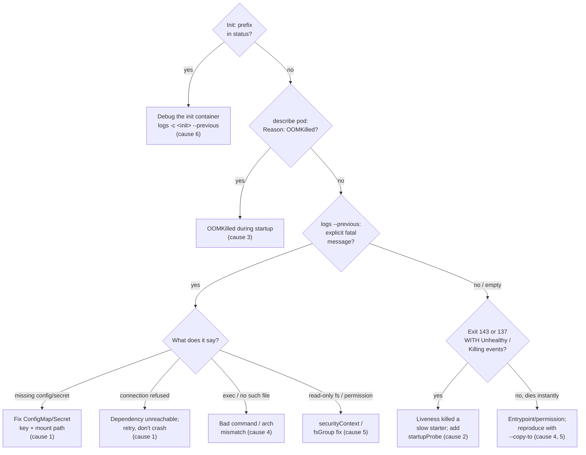

**Symptom:** `STATUS: CrashLoopBackOff`, restart count climbing. Your container starts, exits, and the kubelet restarts it — with an increasing delay between attempts.

## What the loop actually is

`CrashLoopBackOff` is not an error state; it's a *waiting* state. After each crash the kubelet backs off before retrying: 10s, 20s, 40s, 80s, 160s, capped at **5 minutes**, and the backoff resets after a container runs cleanly for 10 minutes. That's why the pod alternates between `Running` (briefly) and `CrashLoopBackOff`, and why "it's up!" for 30 seconds means nothing.

Practical consequence: to catch the container alive you may have to wait out a 5-minute backoff. `kubectl get pods -w` shows you the rhythm.

## Step zero: read the previous container's logs

The *current* container often hasn't logged anything — it's either restarting or not started. The evidence is in the previous instance:

```bash
kubectl logs <pod> --previous
kubectl logs <pod> --previous -c <container>    # multi-container pods
```

Then get the exit code and reason:

```bash
kubectl describe pod <pod> | grep -A8 "Last State"
```

```console
    Last State:     Terminated
      Reason:       Error
      Exit Code:    1
      Started:      Thu, 02 Jul 2026 14:31:07 +0000
      Finished:     Thu, 02 Jul 2026 14:31:09 +0000
```

**Look at Started→Finished duration.** Died in 2 seconds = crash on boot. Died after exactly your liveness window = probably a probe kill. Exit code decoding is in [Triage Methodology](/troubleshooting/triage-methodology/).

## Causes, ranked by likelihood

### 1. App crashes on boot

Exit code 1 (or another small nonzero), short lifetime, and — almost always — an explicit fatal message in `logs --previous`. The usual suspects:

- **Missing config or secret**: `required env PAYMENT_API_KEY not set`, `no such file /etc/app/config.yaml`. Check the mounted reality, not the manifest: does the ConfigMap/Secret exist, does it have that *key*, is the mount path what the app expects? See [Configuration](/workloads/configuration/).

```bash
kubectl get configmap <name> -o yaml | head -20
kubectl get secret <name> -o jsonpath='{.data}' | tr ',' '\n'
```

- **Dependency unreachable**: `connection refused` to a DB or broker. The app may be fine and the dependency down — or DNS/NetworkPolicy blocking it ([Service Unreachable](/troubleshooting/service-unreachable/)). Apps that crash instead of retrying turn every DB blip into a crash loop.
- **Port already in use**: `bind: address already in use` — usually a sidecar or a second process in the same pod grabbing the same port (containers in a pod share the network namespace).

### 2. Liveness probe killing a slow starter

This one *masquerades* as a crash and burns hours. The app is healthy but starts slower than the liveness probe allows; the kubelet kills it; repeat forever. Tell-tale signs:

- Exit code **143** or **137** rather than 1. 143 means the app handled the SIGTERM; 137 means it ignored or mishandled it and got SIGKILLed after the grace period — common when the process is wedged, which is exactly why liveness fired ([Triage Methodology](/troubleshooting/triage-methodology/)).
- Lifetime ≈ `initialDelaySeconds + failureThreshold × periodSeconds`.
- Events say so explicitly:

```console
Warning  Unhealthy  2m  kubelet  Liveness probe failed: Get "http://10.42.3.17:8080/healthz":
  dial tcp 10.42.3.17:8080: connect: connection refused
Normal   Killing    2m  kubelet  Container api failed liveness probe, will be restarted
```

Fix: add a `startupProbe` (the right tool for slow starters) or extend the liveness window. JVMs after a base-image or heap change are the classic offenders. Full treatment in [Health Checks](/workloads/health-checks/).

### 3. OOMKilled inside the loop

Exit code **137**, `Reason: OOMKilled`. The app boots, allocates past the memory limit (cache warm-up, big config load), dies, repeats. Because it happens during startup, it loops just like a code crash. Confirm the reason field, then go to [OOMKilled](/troubleshooting/oomkilled/).

### 4. Bad command or entrypoint

Exit immediately with shell-flavored errors:

```console
$ kubectl logs api-7d4b9c6f8-2xkqp --previous
exec /app/strat: no such file or directory
```

Typo'd `command:`/`args:` in the manifest, a binary that isn't in the image, or — sneaky — a binary built for the wrong architecture (`exec format error`: amd64 image on arm64 nodes or vice versa). Also: exit code **0** in a crash loop means your process *finished successfully* — the entrypoint ran a one-shot command instead of a server, or the app daemonized and PID 1 returned.

### 5. File permissions and security context

The image assumes root but your pod (or a cluster policy) says otherwise:

- `runAsNonRoot: true` + image whose user is root: `container has runAsNonRoot and image will run as root` — this shows in *events*, not logs, as `CreateContainerConfigError`.
- App writes to `/var/log/app` or `/tmp` but `readOnlyRootFilesystem: true`: `read-only file system` in logs. Fix: mount an `emptyDir` at the writable paths.
- Volume files owned by root, app runs as uid 1000: `permission denied` opening data files. Fix: `fsGroup` in the pod securityContext.

### 6. Init containers crash-looping

Status shows `Init:CrashLoopBackOff` or `Init:Error` — the main container never gets a turn. Debug the init container specifically:

```bash
kubectl logs <pod> -c <init-container-name> --previous
kubectl get pod <pod> -o jsonpath='{.spec.initContainers[*].name}'
```

Classic init failures: a wait-for-DB script whose target moved, a migration job hitting a schema lock, a chmod/chown init step blocked by the same securityContext issues above.

## Reproducing without the crash: `kubectl debug --copy-to`

When the container dies too fast to inspect, make a copy of the pod with the command replaced by sleep, then poke around inside at leisure:

```bash
kubectl debug <pod> -it --copy-to=crashpad \
  --container=<container> -- sleep infinity

# In another terminal (or the same, after it attaches):
kubectl exec -it crashpad -c <container> -- sh
```

Inside the copy you have the exact image, env vars, mounted ConfigMaps/Secrets, and service account — everything except the crash. Run the real entrypoint by hand and watch it fail interactively:

```console
/ $ env | grep -i payment
PAYMENT_API_URL=https://payments.internal
/ $ /app/server
FATAL: required environment variable PAYMENT_API_KEY is not set
```

Clean up when done: `kubectl delete pod crashpad`. Note the copy is a standalone pod — no owner, no Service traffic — which is exactly what you want. More patterns in [Debugging Toolbox](/troubleshooting/debugging-toolbox/).

:::note[No shell in the image?]
Distroless images have no `sh`, so the exec above fails. Use `--copy-to` together with an ephemeral debug container, or override with a debug image — see [Debugging Toolbox](/troubleshooting/debugging-toolbox/).
:::

:::tip[Buy yourself log time during a loop]
Racing the backoff to run `kubectl logs` on the brief `Running` window is miserable. Don't — `--previous` always has the last full crash, and that's the reliable tool. Note that `kubectl logs -f` started during the backoff does **not** carry over into the next attempt: the stream ends at the end of the current (dead) container's log. To watch successive attempts, re-run `kubectl logs -f` after each restart, use a tool like `stern` that re-attaches for you, or loop it honestly:

```bash
while true; do kubectl logs -f <pod> || sleep 1; done
```
:::

## Decision path



1. `kubectl logs <pod> --previous` — explicit fatal error? → fix config/dependency/code (cause 1, 4, 5).
2. `kubectl describe pod` → `Reason: OOMKilled`? → [OOMKilled](/troubleshooting/oomkilled/).
3. Exit 143 *or* 137 + `Unhealthy`/`Killing` events? → liveness probe (cause 2). (137 without those events and `Reason: OOMKilled` is step 2 — the events are the discriminator.)
4. `Init:` prefix in status? → debug the init container (cause 6).
5. Logs empty, dies instantly? → entrypoint/permission problem; reproduce with `--copy-to` (cause 4, 5).

## Prevention

- Always ship a `startupProbe` for anything that takes >10s to boot.
- Fail fast *with a clear message* on missing config — a named env var in a fatal log line is a 30-second fix; a silent exit 1 is an hour.
- Retry dependencies with backoff instead of crashing; let readiness (not death) signal "not ready".
- Keep liveness probes dumb and cheap; never point liveness at a check that includes downstream dependencies.
- In CI, run the container image with production-like securityContext (`runAsNonRoot`, `readOnlyRootFilesystem`) so permission crashes happen before prod.
