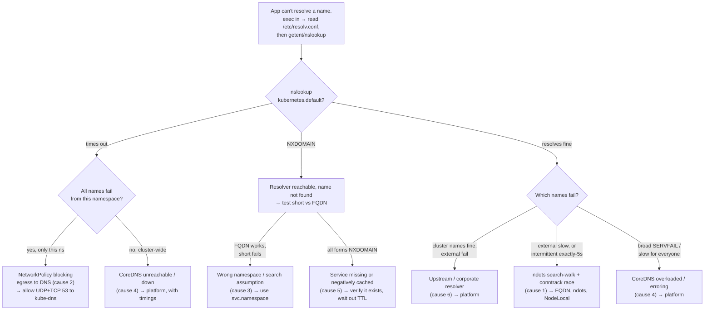

**Symptom:** an app throws `UnknownHostException`, `Name or service not known`, `getaddrinfo ENOTFOUND`, `could not translate host name`, or just times out connecting to a name that "should work." Sometimes *every* lookup fails; sometimes only external names fail; sometimes it works but a random request stalls for almost exactly five seconds. Those are three different failures with three different owners — this page tells them apart from *your* seat, without needing to read CoreDNS logs.

The resolution path is deterministic once you read one file: the pod's `/etc/resolv.conf`. Everything downstream of it — CoreDNS, NodeLocal DNSCache, the upstream resolvers — is platform-owned and you mostly can't touch it. What you *can* touch: your pod's `dnsPolicy`/`dnsConfig`, your NetworkPolicy, and which name your app dials. Start there.

:::note[This is the playbook; the reference lives elsewhere]
The deep mechanics — the Corefile plugin chain, the conntrack race, the cache layers — live in [DNS inside the cluster](/networking/dns/), the [CoreDNS deep dive](/routing/coredns-deep-dive/), and [NodeLocal DNSCache](/cluster-networking/nodelocal-dnscache/). This page is the incident-time triage: cheapest tests first, symptom → owner.
:::

## Fast triage: three cheap tests from inside the pod

Exec into an affected pod (or, if it's toolless, attach a debug container — [Debugging Toolbox](/troubleshooting/debugging-toolbox/)) and run these in order. Each one bisects the problem.

### 1. Read the resolver config

```bash
kubectl exec deploy/orders -- cat /etc/resolv.conf
```

A healthy `ClusterFirst` pod looks like this:

```console
search myteam.svc.cluster.local svc.cluster.local cluster.local
nameserver 10.96.0.10
options ndots:5
```

Three lines, three things to confirm:

- **`nameserver`** is the cluster DNS ClusterIP — traditionally `10.96.0.10` (the Service is named `kube-dns` in `kube-system` for historical reasons, even when CoreDNS is the backend). If it's a `169.254.x.x` link-local address like `169.254.20.10`, you have [NodeLocal DNSCache](/cluster-networking/nodelocal-dnscache/) in front. If it's *your node's* corporate resolver and there's no `svc.cluster.local` in the search list, the pod is on `dnsPolicy: Default` and **cannot resolve cluster services at all** — that's the bug, and it's yours (see the knobs section below).
- **`search`** ends in `svc.cluster.local cluster.local` and starts with *your* namespace. Wrong namespace here means short names resolve against the wrong place.
- **`options ndots:5`** is the default. Remember it — it's the accelerant behind the slow-external-lookup and 5-second symptoms below.

If this file is wrong, stop — nothing downstream matters. resolv.conf is set by the pod's `dnsPolicy`/`dnsConfig`, which you own.

### 2. Resolve a known-good name

```bash
nslookup kubernetes.default
```

`kubernetes.default` (the API Service, always present) is the canary. Good:

```console
Server:    10.96.0.10
Address:   10.96.0.10#53

Name:      kubernetes.default.svc.cluster.local
Address:   10.96.0.1
```

Bad — a timeout or `connection timed out; no servers could be reached` — means the resolver itself is unreachable: either a NetworkPolicy is dropping your egress to DNS (very common, and yours — see cause 2), or CoreDNS is genuinely down (platform). An `NXDOMAIN` here, by contrast, is not a reachability problem — the resolver answered, it just said "no such name," which points at search-domain or naming issues (cause 3).

:::tip[No nslookup in the image?]
Minimal images (distroless, busybox, scratch) often ship no `nslookup`. Fall back to `getent hosts` (present anywhere glibc/musl is), which exercises the *real* resolver path your app uses:

```console
$ getent hosts kubernetes.default
10.96.0.1   kubernetes.default
```

Empty output + non-zero exit = did not resolve. The full toolless-pod story (musl vs glibc quirks, what busybox `nslookup` does and doesn't show) is in [busybox](/troubleshooting/busybox/).
:::

### 3. Short name vs FQDN

This one test localizes most naming bugs. For a Service `payments` in namespace `checkout`, try the escalating forms:

```bash
nslookup payments                                    # relies on search domains
nslookup payments.checkout                           # service.namespace
nslookup payments.checkout.svc.cluster.local         # fully qualified
```

Interpretation:

- **All three work** → DNS is fine; your problem is elsewhere ([Service Unreachable](/troubleshooting/service-unreachable/)).
- **FQDN works, short forms fail** → search-domain / `ndots` machinery isn't doing what you think (or you're cross-namespace — cause 3).
- **`payments` fails but `payments.checkout` works** → the Service is in *another* namespace and your search path only appends *your* namespace. Use the qualified name (cause 3).
- **All three fail with NXDOMAIN, but `kubernetes.default` resolved** → the Service genuinely doesn't exist under that name (typo, wrong namespace, or not created yet — and possibly negatively cached, cause 5).

## The resolution path (in one breath)

```text
pod /etc/resolv.conf
   → [maybe] NodeLocal DNSCache @ 169.254.20.10   (per-node cache; platform)
   → CoreDNS via the kube-dns ClusterIP :53         (cluster names answered here)
   → upstream resolvers                             (external names forwarded here; corporate DNS)
```

Cluster names (`*.svc.cluster.local`) are synthesized in CoreDNS from its API watch — sub-millisecond, in-memory. External names are *forwarded* out to the node's corporate resolvers. That split is the single most useful thing to know at 2 a.m.: **which kind of name failed tells you which layer to suspect.** The server side of this is the [CoreDNS deep dive](/routing/coredns-deep-dive/); Kubernetes' own reference is [DNS for Services and Pods](https://kubernetes.io/docs/concepts/services-networking/dns-pod-service/).

## Causes, with the literal symptom and the check for each

### 1. The ndots:5 search-walk tax (slow, intermittent, mostly external)

**Symptom:** cluster names are fine, but external calls (`api.stripe.com`, `s3.amazonaws.com`) are slow, and under load a lucky-few requests stall ~5 seconds. Because `api.stripe.com` has fewer than 5 dots, `ndots:5` makes the resolver try every search suffix *first* — `api.stripe.com.myteam.svc.cluster.local`, `.svc.cluster.local`, `.cluster.local` — each an NXDOMAIN round-trip, before the real query. That's 4+ lookups (8 with parallel A+AAAA) per external name.

**Check:** time it, and watch the walk:

```bash
kubectl exec deploy/orders -- sh -c "time getent hosts api.stripe.com"
```

The discrete **exactly-5.0s** stall (not a smooth spread) is a separate, deeper signature: a dropped UDP packet waiting out the resolver retransmit timer, caused by a kernel conntrack race that `ndots` merely *feeds* with extra queries. Do not re-derive it here — the mechanics and fixes are in [NodeLocal DNSCache](/cluster-networking/nodelocal-dnscache/) and the ndots section of [DNS inside the cluster](/networking/dns/). Your quick wins, no ticket required: use a trailing-dot FQDN (`api.stripe.com.` skips the search walk), or lower `ndots` per pod via `dnsConfig` (below).

### 2. NetworkPolicy blocking egress to DNS (all lookups fail from one namespace)

**Symptom:** *every* name fails — cluster and external alike — but only from pods in one namespace, and `kubernetes.default` times out rather than returning NXDOMAIN. Classic after someone adds a default-deny-egress policy: the moment any egress policy selects a pod, egress becomes default-deny for it, and **DNS is egress too**. If you didn't explicitly allow port 53 to kube-dns, you've silently cut off name resolution for the whole app.

**Check:**

```bash
kubectl get networkpolicy
kubectl describe networkpolicy <name>   # is there an egress allow for DNS?
```

The fix is an allow-DNS rule permitting **both UDP and TCP on port 53** to the kube-system / kube-dns pods (TCP matters — large answers and NodeLocal's upstream hop use it). The subtlety that bites people: an `egress` rule needs *both* a destination selector **and** a port; get the namespace selector wrong and it silently allows nothing. Write it, then re-run test 2 to confirm. Policy shapes, the DNS-allow snippet, and the default-deny gotcha are in [Network Policies](/networking/network-policies/).

### 3. Wrong name / wrong assumption about the search domain (cross-namespace)

**Symptom:** `payments` gives NXDOMAIN, but the Service demonstrably exists — in *another* namespace. Your pod's search list only appends *your* namespace's suffix, so a bare short name never finds a Service elsewhere.

**Check:** test `svc` vs `svc.otherns` (test 3 above). The fix is in your config, not the cluster: always write at least `service.namespace`, ideally the full `service.namespace.svc.cluster.local`, in ConfigMaps and connection strings. A bare service name works today and breaks silently the day the config is copied to another namespace. The FQDN-forms table is in [DNS inside the cluster](/networking/dns/).

### 4. CoreDNS overloaded or erroring (platform-owned)

**Symptom:** intermittent `SERVFAIL`, or lookups that used to be instant now take hundreds of ms across the board — for *everyone*, not just your namespace. This is the platform's DNS tier struggling: upstream flapping, both replicas disrupted by a drain, or capacity.

**Check from your seat:** you can't read CoreDNS metrics or logs, but you can characterize it. Run the *pairing* — one cluster name and one external name, from the same pod, in the same minute:

```bash
kubectl exec deploy/orders -- sh -c "getent hosts orders.myteam.svc.cluster.local; time getent hosts api.stripe.com"
```

If the cluster name is instant and the external one SERVFAILs/times out, the `forward` (upstream) path is broken (cause 6). If *both* degrade together, suspect CoreDNS itself. Either way it's a platform escalation — attach the timings. The failure decoder table (symptom shape → server-side state) is in the [CoreDNS deep dive](/routing/coredns-deep-dive/).

### 5. Negative caching / stale record after the "fix"

**Symptom:** corporate DNS fixed a record five minutes ago; `dig` from your laptop works; your pods *still* fail. Or: a brand-new Service was created and won't resolve for a bit. NXDOMAIN/NODATA answers are cached, and there can be **three cache layers** holding the stale answer — CoreDNS, NodeLocal DNSCache, and your app's own resolver cache (the JVM is a repeat offender).

**Check:** confirm it's a cached denial rather than a live one — the negative TTL counts down in the AUTHORITY section:

```bash
kubectl exec deploy/orders -- dig newapp.company.com +noall +authority
```

An SOA line with a small number is a cached NXDOMAIN with that many seconds left. Reach for a retry/backoff, not a redeploy — it clears itself. The cache-layer semantics are in the [CoreDNS deep dive](/routing/coredns-deep-dive/#the-corefile-line-by-line) and [NodeLocal DNSCache](/cluster-networking/nodelocal-dnscache/). If it persists well past the TTL, ask platform for the cache config.

### 6. Upstream / external resolver failing (external names only)

**Symptom:** cluster names resolve perfectly; external names (`*.com`, corporate hostnames) fail with SERVFAIL or timeout. CoreDNS forwards external queries to the *node's* corporate resolvers, so this is usually a corporate-DNS problem observed through a Kubernetes periscope — not a cluster bug.

**Check:** the same pairing from cause 4. Cluster-good + external-bad is the fingerprint. If you need an internal zone routed to specific resolvers, that's a CoreDNS **stub domain** — a platform request, documented (with the exact ticket to file) in the [CoreDNS deep dive](/routing/coredns-deep-dive/#stub-domains-the-enterprise-integration-point).

## The knobs you actually own: dnsPolicy and dnsConfig

Before escalating, remember three things are yours to change per pod, no platform ticket:

```yaml
spec:
  dnsPolicy: ClusterFirst          # the default — cluster DNS + search domains
  dnsConfig:
    options:
      - name: ndots
        value: "2"                 # tame the search-walk for external-heavy apps
      - name: single-request-reopen  # serialize A/AAAA; dodges the UDP conntrack race (glibc)
```

`dnsPolicy: Default` inherits the *node's* resolv.conf and **cannot resolve cluster Services** — occasionally right for egress-only batch jobs, a silent outage if set by accident. Test with the *exact* names your app uses before rolling `ndots` changes to prod; `ndots: 1` can break short-name resolution in some resolvers' edge cases. Full mechanics and a `dnsPolicy: None` example are in [DNS inside the cluster](/networking/dns/).

## Decision cue: which name failed?



The short version:

- **Cluster names fail, external fine** → CoreDNS's `kubernetes` plugin or your NetworkPolicy — check your side first.
- **External names fail, cluster fine** → upstream / corporate DNS — platform.
- **Everything fails from one namespace** → NetworkPolicy egress to DNS — yours.
- **Everything fails cluster-wide** → CoreDNS down — platform.
- **Intermittent exactly-5s** → conntrack race — mitigate with `dnsConfig`, escalate for NodeLocal DNSCache.

## Escalation boundary

**Platform owns:** the CoreDNS pods, its Corefile and cache TTLs, the NodeLocal DNSCache DaemonSet, and the upstream/corporate resolvers. You can't (and shouldn't try to) `kubectl` your way into `kube-system` to fix these.

**You own:** the pod's resolv.conf (via `dnsPolicy`/`dnsConfig`), your NetworkPolicy egress rules, and using the correct name in your config. Rule those out before filing a ticket — a large fraction of "CoreDNS is broken" tickets are actually a default-deny NetworkPolicy or a bare cross-namespace name.

**Escalate WITH evidence.** "DNS is flaky" bounces straight back. A ticket that gets actioned states:

- **Which names fail** — and crucially the *pairing*: one cluster name and one external name, `getent`/`dig`-ed from the same pod in the same minute, with timings.
- **From which namespace and pod** you tested.
- **The `nslookup`/`dig`/`getent` output** and observed timing (smooth-slow vs discrete-5s vs instant-NXDOMAIN — they mean different things).
- **Blast radius** — all pods or one, one namespace or cluster-wide, since when.

The etiquette that gets DNS tickets actioned same-day is in [working with the platform team](/operations/working-with-platform-team/). DNS is the first hop in almost every flow, which is why it's also step one in the [network debugging playbook](/networking/debugging-network/).
