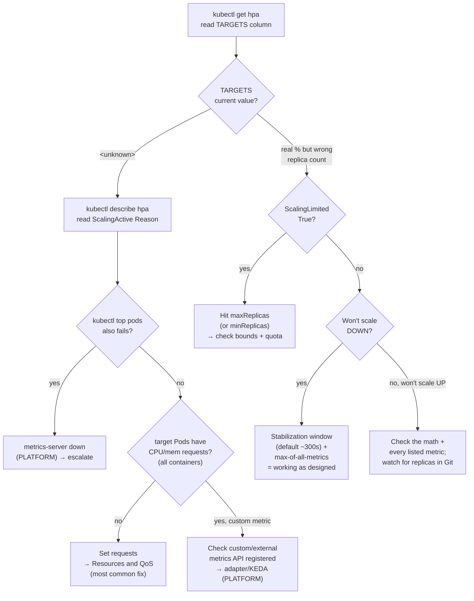

**Symptom:** load is up, latency is climbing, and the pod count hasn't moved. Or the reverse — traffic died an hour ago and you're still paying for twelve replicas. The HorizontalPodAutoscaler is either blind, boxed in, or doing exactly what you told it to and you disagree. Almost every one of these resolves from two commands, and the answer is usually sitting in plain text in the second one.

This is the *runbook*. The concept page — HPA v2 math, `behavior` tuning, VPA, KEDA — is [Autoscaling](/workloads/autoscaling/). Come here when it's already broken.

## The fast path

Two commands, in order. Do not skip the second.

```console
$ kubectl get hpa
NAME       REFERENCE             TARGETS         MINPODS   MAXPODS   REPLICAS   AGE
payments   Deployment/payments   184%/70%        3         12        12        21d
reports    Deployment/reports    <unknown>/80%   2         8         2         4d
web        Deployment/web        41%/70%         2         10        4         60d
```

The **TARGETS** column is `current / target`. Read it like a triage light:

- `184%/70%` — metrics are flowing, the HPA *wants* to scale up. If REPLICAS is stuck at MAXPODS (here 12), you're capped, not broken.
- `41%/70%` — healthy and idle. Nothing wrong.
- `<unknown>/80%` — **the HPA can't compute utilization.** This is the single most common failure, and the rest of this page leans on it. It means one of two things, and you find out which with `describe`.

```console
$ kubectl describe hpa reports
```

Scroll to two places and read them before you touch anything:

```console
Metrics:                    ( current / target )
  resource cpu on pods  (as a percentage of request):  <unknown> / 80%
Min replicas:             2
Max replicas:             8
Conditions:
  Type            Status  Reason                   Message
  ----            ------  ------                   -------
  AbleToScale     True    SucceededGetScale        the HPA controller was able to get the target's scale
  ScalingActive   False   FailedGetResourceMetric  the HPA was unable to compute the replica count:
                                                   failed to get cpu utilization: unable to get metrics
                                                   for resource cpu: no metrics returned from resource
                                                   metrics API
Events:
  Type     Reason                   Age                 From                       Message
  ----     ------                   ----                ----                       -------
  Warning  FailedGetResourceMetric  12s (x91 over 22m)  horizontal-pod-autoscaler  failed to get cpu
                                                        utilization: unable to get metrics for resource cpu
```

The three **Conditions** are the whole diagnosis:

| Condition | What it means when `False` / `True` |
|---|---|
| `AbleToScale` | `False` → the HPA can't even read or write the target's replica count (bad `scaleTargetRef`, target deleted). Rare; fix the ref. |
| `ScalingActive` | `False` → the HPA has no usable metric to compute against. **This is the `<unknown>` case.** Read the `Reason` and `Message`. |
| `ScalingLimited` | `True` → the HPA *wants* to move but is pinned at `maxReplicas` (or `minReplicas` on the way down). Not a bug — a boundary. |

The rest of this page is one section per Reason you'll see there.

## `<unknown>` target + `FailedGetResourceMetric`

**Symptom:** TARGETS shows `<unknown>/80%`; `describe` shows `ScalingActive False`, reason `FailedGetResourceMetric`, message some flavor of `unable to get metrics for resource cpu` or `failed to get cpu utilization`. There are exactly two causes, and the second is the one you can fix yourself.

### Cause (a): metrics-server isn't there (PLATFORM)

Resource metrics (CPU/memory) come from **metrics-server**, a cluster-level component the platform team installs and runs. If it's missing, unhealthy, or unreachable, every Resource-type HPA in the cluster goes `<unknown>` at once.

**Check** — the same data source `kubectl top` uses, so test it directly:

```console
$ kubectl top pods
error: Metrics API not available
```

If `kubectl top pods` fails too, it's not your HPA — the metrics pipeline is down cluster-wide. Confirm the API is even registered:

```console
$ kubectl get --raw "/apis/metrics.k8s.io/v1beta1" | head -c 200
Error from server (ServiceUnavailable): the server is currently unable to handle the request
```

**Fix:** this is a [platform-team conversation](/operations/working-with-platform-team/), not a manifest change. You cannot install metrics-server from inside your namespace. Escalate with the evidence (see the boundary section below).

### Cause (b): your Pods have no CPU/memory `requests` (YOURS)

**This is the most common cause an app team can actually fix.** CPU `Utilization` is defined as *usage as a percentage of the request*. No request → no denominator → the HPA can't produce a percentage → `<unknown>`. `kubectl top pods` works fine in this case (metrics-server is healthy), which is how you tell (b) apart from (a).

The `describe` message is often more specific here:

```console
  Warning  FailedGetResourceMetric  8s  horizontal-pod-autoscaler
           failed to get cpu utilization: missing request for cpu in container app
```

**Check** — does every container in the target have a CPU request?

```console
$ kubectl get deploy reports -o jsonpath='{range .spec.template.spec.containers[*]}{.name}: {.resources.requests}{"\n"}{end}'
app:
log-shipper: {"cpu":"50m","memory":"64Mi"}
```

Here `app` has no requests at all. **Every container in the pod needs a request for the resource the HPA targets** — one request-less sidecar (istio-proxy is the classic) blinds a CPU HPA even if your app container is set correctly.

**Fix:** set CPU (and/or memory) `requests` on the target's pod template. Sizing is not guesswork — see [Resources and QoS](/workloads/resources-and-qos/) for the methodology, and note the trap on the other side: a request set *too low* makes idle utilization read >100%, pinning the HPA at `maxReplicas` at rest (covered in [Autoscaling](/workloads/autoscaling/)). Get the number honest, don't just make the error go away.

## `ScalingActive False` but metrics *are* present

**Symptom:** TARGETS shows a real number (not `<unknown>`), so metrics flow, but replicas don't move the way you expect. This is a math problem, not a plumbing problem.

**Check** the arithmetic. The loop is:

```text
desiredReplicas = ceil(currentReplicas × currentMetric / targetMetric)
```

With `41%/70%` and 4 replicas: `ceil(4 × 41 / 70)` = `ceil(2.34)` = 3, but `minReplicas` may floor you at 4 — so "it's not scaling down" is correct behavior. Plug your own numbers in before calling it broken.

**Multiple metrics:** if the HPA lists several metrics, it computes a desired replica count for *each* and **takes the maximum**. So a memory metric quietly demanding 8 replicas will hold you at 8 even while CPU says 3. Read every line under `Metrics:` in `describe`, not just the one you care about. (Memory is a poor scaling signal for most runtimes — see [Autoscaling](/workloads/autoscaling/) — this is one reason why.)

**Not-Ready pods** are excluded from the scale-up utilization average but still count toward `currentReplicas` for limits. Mid-rollout the numbers look strange; let the rollout settle before diagnosing.

## `ScalingLimited True` — you hit a bound

**Symptom:** `describe` shows `ScalingLimited True`, and REPLICAS in `kubectl get hpa` equals MAXPODS (or MINPODS). The HPA is working perfectly; it's clamped. If it pins at max for half an hour on a fixed on-prem pool, that's a budget question, not a YAML question — [Capacity and Governance](/autoscaling/capacity-and-governance/) is that conversation.

```console
Conditions:
  Type            Status  Reason            Message
  ScalingLimited  True    TooManyReplicas   the desired replica count is more than the maximum replica count
```

**Check** your bounds against what the metric is asking for:

```console
$ kubectl get hpa payments -o jsonpath='min={.spec.minReplicas} max={.spec.maxReplicas} desired={.status.desiredReplicas} current={.status.currentReplicas}{"\n"}'
min=3 max=12 desired=18 current=12
```

`desired=18` against `max=12` means the metric wants more than you'll allow. **Fix:** raise `maxReplicas` — but size it against reality, not optimism. An HPA scaling your API to 40 pods is a machine for turning a traffic spike into a database connection-pool outage, and 40 pods must fit your namespace [quota](/workloads/resources-and-qos/) or the new pods sit `Pending` (see [Pod Pending](/troubleshooting/pod-pending/)). On the low side, `TooFewReplicas` at `minReplicas` on the way down is equally intentional.

## Not scaling DOWN (or scaling down slowly)

**Symptom:** load dropped, but replicas stay high for minutes, then trickle down. People assume it's stuck. It usually isn't — this is designed behavior.

Two mechanisms are in play, and both make scale-down deliberately sluggish:

1. **The scale-down stabilization window.** By default the HPA will not shrink unless it has *continuously wanted* fewer replicas for the whole window — commonly **300 seconds** (this default is version-sensitive; confirm on your cluster). Over that window it uses the *highest* recommendation, so a single brief traffic blip resets the clock. This is the anti-flapping defense; it is working as intended.

2. **Any metric wanting more wins.** Because multiple metrics take the max desired count, one metric still calling for more replicas holds the whole HPA up even as others say scale down. Memory that a runtime never releases is the usual culprit.

**Check** — watch it decide over time rather than glancing once:

```console
$ kubectl get hpa payments --watch
$ kubectl describe hpa payments   # Events log each SuccessfulRescale with a reason
```

**Fix / tune:** scale-down speed is the `behavior.scaleDown` block (API `autoscaling/v2`) — `stabilizationWindowSeconds` and rate `policies`. Shorten the window if your traffic genuinely warrants faster shrink; the full field reference and a recommended aggressive-up/timid-down profile are in [Autoscaling](/workloads/autoscaling/). If it *never* scales down at all, `behavior.scaleDown.selectPolicy: Disabled` may have been set (sometimes during an incident and never reverted) — check for it.

## Custom / external metrics (Prometheus adapter, KEDA)

**Symptom:** an HPA (or KEDA `ScaledObject`) targeting queue depth, RPS, or any non-CPU/memory metric shows `<unknown>` or `FailedGetExternalMetric` / `FailedGetPodsMetric`.

Resource metrics come from metrics-server; **custom and external metrics come from a separate metrics adapter** (the Prometheus Adapter, or KEDA's own metrics server) that must be installed *and* healthy and that registers its own aggregated API. If that API isn't served, the metric is `<unknown>` no matter how correct your manifest is.

**Check** whether the metrics APIs are even registered:

```console
$ kubectl get --raw "/apis/custom.metrics.k8s.io/v1beta1" | head -c 120
$ kubectl get --raw "/apis/external.metrics.k8s.io/v1beta1" | head -c 120
```

An error or "the server could not find the requested resource" means no adapter is serving that API — the metric can never resolve. You can also list registered aggregated APIs:

```console
$ kubectl get apiservices | grep -E 'custom|external|metrics'
```

**Fix:** the adapter is a cluster-level install (PLATFORM). Your side is the metric *query/trigger* in the `ScaledObject` or HPA spec. For event-driven and queue-depth scaling — including scale-to-zero — [KEDA](/architectures/keda-autoscaling/) is the grown-up answer and manages its own HPA under the hood, so the `behavior`/stabilization concepts above still apply. Don't create your own HPA against a Deployment KEDA already manages.

## Deployment `replicas` fighting the HPA

**Symptom:** the fleet scales up correctly, then a CI/CD deploy drops it back to 3 pods and users notice. Repeats every deploy.

**Cause:** the Deployment manifest in Git still sets `spec.replicas: 3`. Every `kubectl apply` resets the count to that value; the HPA then corrects it back over the next minute. A tug-of-war you lose right after each deploy.

**Fix:** **do not set `replicas` on an HPA-managed Deployment.** Remove the field from the manifest entirely — `kubectl apply` leaves an absent field alone, so the HPA keeps ownership across deploys. This is a first-class [drift problem](/operations/drift-and-cicd/); the pattern (and why a manual `kubectl scale` also evaporates under an HPA) is there. If you need a floor to *stick*, raise `minReplicas`, don't pin `replicas`.

## Decision tree



## Escalation boundary — what's yours vs the platform's

The metrics pipeline is split down the middle, and knowing which side owns the symptom is half the fix (and if the HPA *works* but users still hurt, you may have scaled the wrong number — [the signals catalog](/autoscaling/signals-catalog/) is that diagnosis):

| PLATFORM owns (you can't fix from your namespace) | YOU own |
|---|---|
| metrics-server install/health (`/apis/metrics.k8s.io`) | resource `requests` on your pods (the `<unknown>` fix) |
| custom/external metrics adapters (Prometheus adapter, KEDA install) | the HPA/`ScaledObject` spec: metrics, `minReplicas`/`maxReplicas`, `behavior` |
| LimitRange / ResourceQuota that gates new replicas | not pinning `replicas` on an HPA-managed Deployment |

Before you escalate, gather the evidence that turns a ticket into a conversation:

```console
$ kubectl describe hpa <name>                         # Conditions + Events — the diagnosis
$ kubectl top pods                                     # proves whether metrics-server is alive
$ kubectl get --raw "/apis/metrics.k8s.io/v1beta1"     # is the resource-metrics API registered?
# for custom/external metrics:
$ kubectl get --raw "/apis/custom.metrics.k8s.io/v1beta1"
```

If `kubectl top pods` works and the HPA still says `<unknown>`, the problem is almost certainly on your side (missing requests) — check that before you page the platform team. If `kubectl top` is also down, lead with that: it's their component, and the `describe hpa` + `top` + raw-API triplet tells them exactly where the pipeline broke.

:::tip[The two-command reflex]
`kubectl get hpa` then `kubectl describe hpa <name>`, and *read the Conditions*. The `<unknown>` target with missing requests is the canonical trap; the `describe` Message names it outright. You'll fix most of these before you finish typing a Slack message.
:::
