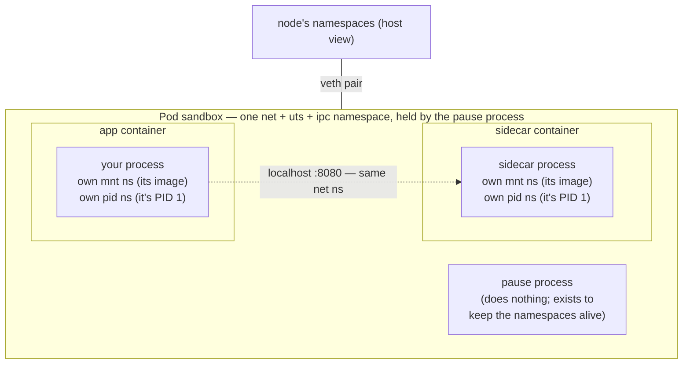
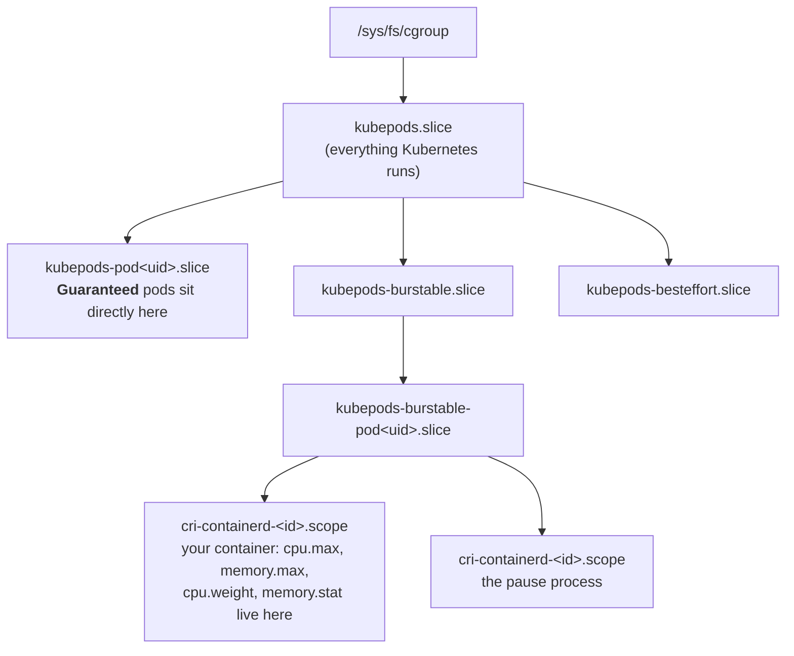

Here is the sentence that reorganizes everything you know about Kubernetes: **there is no such thing as a container.** The kernel has no "container" object — no syscall creates one, no `ps` column shows one. What exists is an ordinary Linux process that has been given a *different view* of the machine (namespaces), a *budget* (cgroups), a *costume* (an overlayfs root filesystem), and *handcuffs* (capabilities and seccomp). A "container" is just the name we give a process wearing all four at once — and the kubelet plus container runtime are, at bottom, a program that makes those four arrangements via ordinary syscalls, then `exec`s your app.

This page maps every Kubernetes concept you use daily onto the kernel primitive that implements it. It's the theory annex to [Linux Inside the Pod](/troubleshooting/linux-inside-the-pod/) — that page tells you which `/proc` and cgroup files to read at 2am; this one explains why those files *are* the truth, and why half of Kubernetes' apparent magic is a fifty-year-old operating system doing what it always did.

## Namespaces: the different view

A namespace wraps one global kernel resource — the process table, the network stack, the mount table — and gives a group of processes their own private copy of it. There are eight kinds ([namespaces(7)](https://man7.org/linux/man-pages/man7/namespaces.7.html) is the canonical tour), and each one answers a Kubernetes question you've had:

| Namespace | Isolates | The Kubernetes fact it explains |
|---|---|---|
| `mnt` | mount table | each container sees its own root filesystem; volumes "appear" at paths |
| `pid` | process IDs | your app is PID 1 inside; `ps` shows three processes, not the node's thousands |
| `net` | interfaces, routes, ports, iptables | each **pod** gets its own IP and port space; two pods can both bind :8080 |
| `uts` | hostname | the container's hostname is the pod name |
| `ipc` | System V IPC, POSIX queues | shared memory (`/dev/shm`) is pod-private |
| `user` | uid/gid mappings | root-in-container ≠ root-on-node — *if* enabled (see below) |
| `cgroup` | cgroup tree visibility | `/sys/fs/cgroup` inside the pod shows *your* subtree as the root |
| `time` | boot/monotonic clocks | rarely used by Kubernetes today |

The load-bearing subtlety is *which namespaces are shared at which level* — this is the actual definition of a pod:

**A pod is a shared network/UTS/IPC namespace; a container is a private mount and PID namespace inside it.** That one sentence explains: why containers in a pod talk over `localhost` (same net namespace — it's genuinely the same loopback interface); why they *can't* see each other's processes or files by default (private pid and mnt namespaces); why the pod, not the container, has the IP; and why two containers in one pod can't both bind port 8080 (one port space per net namespace).

**The pause container** is the trick holding it together. Namespaces are refcounted — they vanish when their last process exits. If your app container held the pod's network namespace and then crashed, the pod's IP and interfaces would evaporate with it. So the runtime starts a tiny process (`pause`) whose only job is to sit in the pod's shared namespaces and keep them alive while real containers come, go, restart, and get replaced. You've seen its fingerprints: the `container!="POD"` filter in [PromQL queries](/observability/promql-for-resources/) excludes exactly this process's cgroup.

The `spec` fields you know are namespace switches wearing YAML:

- `hostNetwork: true` — *don't unshare* the net namespace; the pod lives in the node's network stack (this is how node agents and some ingress controllers run — and why they fight over host ports).
- `hostPID: true` / `hostIPC: true` — same, for the process table and IPC.
- `shareProcessNamespace: true` — merge the pod's containers into **one** pid namespace, so the sidecar can see (and signal) the app's processes. The pause process becomes PID 1 for everyone, which changes the [signal story](/workloads/graceful-shutdown/).
- `hostUsers: false` — opt *into* the user namespace, mapping container-root to an unprivileged node uid. Historically pods shared the host user namespace (container uid 0 really was node uid 0, contained only by the other handcuffs); user-namespaced pods are the newer, stronger default-in-waiting — beta, check your version's feature gates.

And the debugging tools you use are namespace verbs. `kubectl exec` doesn't SSH anywhere: the kubelet asks the runtime to spawn your command with `setns()` into the target container's namespaces ([setns(2)](https://man7.org/linux/man-pages/man2/setns.2.html) — the same thing `nsenter` does by hand on a node). An [ephemeral debug container](/troubleshooting/debugging-toolbox/) is a new container joining the pod's *shared* namespaces — which is why `kubectl debug` can see the app's network but needs `--target` (pid-namespace sharing) to see its processes. And the `/proc/<pid>/root` trick from [the jattach deep dive](/java/jattach-deep-dive/) works because a process's mount namespace is reachable *through* procfs even when it isn't yours.

## cgroups: the budget

Namespaces change what a process *sees*; control groups ([cgroups(7)](https://man7.org/linux/man-pages/man7/cgroups.7.html), [kernel cgroup-v2 guide](https://docs.kernel.org/admin-guide/cgroup-v2.html)) change what it *gets*. Every pod on a node lives in a kernel-maintained tree under `/sys/fs/cgroup`, and the tree's shape *is* your QoS class:

Read your own position from inside any pod — `cat /proc/self/cgroup` — and the path literally spells out your QoS class, as the [survival guide](/troubleshooting/linux-inside-the-pod/#what-sandbox-am-i-in) shows. The mapping from YAML to kernel knobs:

| You write | The kubelet writes | The kernel does |
|---|---|---|
| `resources.limits.cpu: 500m` | `cpu.max: 50000 100000` | CFS quota: 50ms of CPU per 100ms window, then **frozen** — this is [throttling](/troubleshooting/its-slow/) |
| `resources.requests.cpu: 250m` | `cpu.weight` (from shares) | *proportional* share under contention only — never a cap |
| `resources.limits.memory: 512Mi` | `memory.max: 536870912` | exceed it → cgroup OOM kill; since 1.28 `memory.oom.group=1` takes the **whole container**, not one process ([OOMKilled](/troubleshooting/oomkilled/)) |
| `resources.requests.memory` | *(scheduling + eviction input)* | mostly **not** a cgroup knob — it's the scheduler's arithmetic and the eviction ranker's input |
| QoS class | position in the tree + `oom_score_adj` | who dies first under *node* pressure ([Node Problems](/troubleshooting/node-problems/)) |

Two asymmetries worth engraving. **CPU is compressible** — blow the budget and you wait (throttled), which is why CPU limits cause latency, not crashes. **Memory is not** — blow the budget and something dies. That single kernel fact generates most of the advice in [Requests, Limits, and the Knobs](/tuning/requests-limits-knobs/) and [Resources & QoS](/workloads/resources-and-qos/).

And the trap the survival guide hammers: `/proc/meminfo` and `/proc/cpuinfo` are **not namespaced** — they describe the node. The cgroup files describe *you*. Every "my container sees 64 CPUs" bug, every JVM that sized its heap off node RAM before [container awareness](/java/jvm-in-containers/), every `nproc`-based thread pool gone mad — all one confusion: reading a global file and expecting a namespaced answer.

## Overlayfs: the costume

A container image is a stack of read-only tarballs; [overlayfs](https://docs.kernel.org/filesystems/overlayfs.html) is the kernel filesystem that makes the stack look like one root. The image layers become `lowerdir`s, a fresh empty directory becomes your container's `upperdir`, and every write you make lands in the upper layer — copy-on-write, per container:

- **Why container writes are ephemeral:** the upperdir is deleted with the container. Restart = new upperdir = your "saved" file is gone. Persistence is exactly the set of paths where something else is mounted *over* the overlay — your PVCs, ConfigMaps, and `emptyDir`s, which are just bind mounts and tmpfs mounts placed into the container's mount namespace before your process starts ([the mount map](/troubleshooting/linux-inside-the-pod/#where-am-i-orientation-in-60-seconds) shows them all).
- **Why writing to `/` counts against `ephemeral-storage`:** the upperdir lives on the node's disk, and the kubelet meters it — exceed the limit and the pod is evicted ([Volume Failures](/troubleshooting/volume-failures/)).
- **What `readOnlyRootFilesystem: true` is:** literally the `ro` flag on that overlay mount. One mount option, and a whole class of "attacker writes a file" and "app scribbles on its image" problems disappears — which is why the [restricted posture](/workloads/pod-security/) wants it.
- **Why image layers are shared:** two pods from the same image share the same lowerdirs and the same page cache — that's the memory-efficiency story behind "shared file-backed pages" in the survival guide's `smaps_rollup` breakdown.

## Netfilter and veth: the wiring

The pod's network namespace would be an isolated island without a cable out. The CNI plugin provides it: a **veth pair** — two virtual NICs joined at the hip; packets in one end exit the other. One end becomes `eth0` *inside* the pod's net namespace, the other end sits in the node's namespace, wired into a bridge or the routing table. That's the whole "pod networking" trick at node scope; how the fabric spans nodes is [the networking model](/networking/networking-model/).

The Kubernetes objects above that are kernel constructs too:

- A **Service's ClusterIP** answers on no interface anywhere — it's a **DNAT rule**. kube-proxy programs netfilter (iptables chains, IPVS, or nftables) so a packet addressed to the VIP is rewritten mid-flight to a real pod IP. The full chain walk, conntrack and all, is [kube-proxy and the Dataplane](/routing/kube-proxy-and-the-dataplane/) and [NAT](/routing/nat/).
- A **NetworkPolicy** compiles to filter rules (iptables or eBPF programs, depending on CNI) attached to exactly these veth interfaces — which is why [policy enforcement is a CNI feature](/networking/network-policies/), not a Kubernetes-core one.
- `localhost` between pod containers, once more, is no wiring at all: same namespace, same `lo` interface.

## Capabilities and seccomp: the handcuffs

Everything above gives the process a smaller world; `securityContext` takes away its powers within that world — again, one kernel primitive per YAML field:

| You write | Kernel primitive |
|---|---|
| `runAsUser: 1000` | the runtime calls setuid before `exec`ing your app — ordinary Unix uids, same ones `id` shows |
| `capabilities: { drop: [ALL] }` | [capabilities(7)](https://man7.org/linux/man-pages/man7/capabilities.7.html): root's power, shattered into ~40 flags; containers get a small default set, `drop: ALL` empties it — the zeroed `CapEff` mask in [the survival guide](/troubleshooting/linux-inside-the-pod/#what-sandbox-am-i-in) |
| `allowPrivilegeEscalation: false` | the `no_new_privs` process flag: no setuid binary, no file capability can ever *raise* privileges again |
| `seccompProfile: RuntimeDefault` | a seccomp-BPF filter: a syscall allowlist attached to the process — exotic syscalls return `EPERM` instead of reaching kernel code |
| `privileged: true` | all of the above, off. Not "more access" — **host-equivalent** access |

This is why `NET_BIND_SERVICE` exists in your vocabulary (binding ports <1024 is one of those shattered root-powers), why the nginx recipe in [Sidecars](/sidecars/recipes/) needed an unprivileged image, and why [Pod Security Standards](/workloads/pod-security/) are best understood as *a policy about which kernel handcuffs may be left off*.

## What is NOT the kernel (so you don't over-apply this page)

The mapping has edges, and knowing them prevents a different confusion. **Probes** are the kubelet — a userspace process making HTTP calls and running execs on a timer; the kernel neither knows nor cares about readiness ([Health Checks](/workloads/health-checks/)). **The API server, scheduler, and controllers** are ordinary programs holding desired state; the kernel only ever sees the node-local consequences. **DNS** is CoreDNS pods answering queries ([the deep dive](/routing/coredns-deep-dive/)). The clean split: *Kubernetes decides, the kubelet translates, the kernel enforces.* When you debug, knowing which of the three layers owns your symptom is half the diagnosis — it's the "walk the layers" spine of [Triage Methodology](/troubleshooting/triage-methodology/).

## The Rosetta table

The whole page in one artifact — the concept, the primitive, and where to see it with your own eyes from inside a pod:

| Kubernetes says | Linux does | See it yourself |
|---|---|---|
| Pod | shared net + uts + ipc namespaces (held by pause) | `hostname`; two containers curling each other on `localhost` |
| Container | private mnt + pid ns, cgroup scope, overlayfs root | `ls -d /proc/[0-9]*` — three processes, not thousands |
| Pod IP | veth pair into the node, one end as `eth0` | `cat /proc/net/route`; `ip addr` where available |
| `limits.cpu` | CFS quota `cpu.max` | `cat /sys/fs/cgroup/cpu.max`; throttling in `cpu.stat` |
| `limits.memory` | `memory.max` + group OOM kill | `cat /sys/fs/cgroup/memory.max`; `memory.events` oom_kill counter |
| QoS class | cgroup tree position + oom_score_adj | `cat /proc/self/cgroup` — the path names your class |
| Image / writable layer | overlayfs lowerdirs / upperdir | `grep overlay /proc/mounts` |
| Volumes, ConfigMaps, Secrets | bind + tmpfs mounts in the mnt ns | `grep -E 'ext4|tmpfs' /proc/mounts` |
| `readOnlyRootFilesystem` | `ro` on the overlay mount | `touch /probe` → `Read-only file system` |
| Service ClusterIP | netfilter DNAT rewrite | (node side) [the chain walk](/routing/kube-proxy-and-the-dataplane/) |
| `securityContext` | setuid, capability sets, no_new_privs, seccomp | `grep Cap /proc/self/status`; `grep NoNewPrivs /proc/self/status` |
| `kubectl exec` / debug container | `setns()` into existing namespaces | `ls -l /proc/self/ns/` — the namespace inode links themselves |

If this table reads like a translation you could have written yourself, the deep dive did its job — and the [survival guide](/troubleshooting/linux-inside-the-pod/) becomes not a list of magic file paths but the obvious set of places to look. For the primitives' own documentation, three references cover essentially everything here: [namespaces(7)](https://man7.org/linux/man-pages/man7/namespaces.7.html), [cgroups(7)](https://man7.org/linux/man-pages/man7/cgroups.7.html) with the [cgroup-v2 admin guide](https://docs.kernel.org/admin-guide/cgroup-v2.html), and [capabilities(7)](https://man7.org/linux/man-pages/man7/capabilities.7.html).
