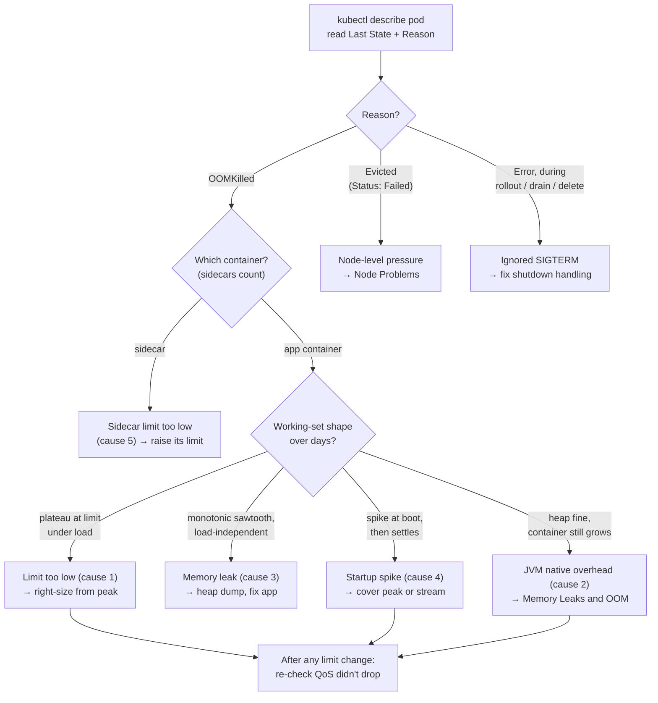

**Symptom:** container restarts with exit code 137, `describe` shows `Reason: OOMKilled`. The kernel killed your process because the container's memory cgroup hit its limit. On cgroup-v2 clusters (the kubelet sets `memory.oom.group` since Kubernetes 1.28) the kill takes out *every* process in the container's cgroup at once — not one unlucky victim. It is instant and unlogged — the app gets no signal, no chance to flush, no stack trace. Your logs just *stop*.

:::tip[War story]
The Java special has a Field Note: [OOMKilled, but the Heap Was Fine](/blog/oomkilled-but-the-heap-was-fine/) — direct buffers, metaspace, and thread stacks eating the budget while the heap dump looked healthy.
:::

## Confirm it was actually OOM

```bash
kubectl describe pod <pod> | grep -B2 -A8 "Last State"
```

```console
    Last State:     Terminated
      Reason:       OOMKilled
      Exit Code:    137
      Started:      Fri, 03 Jul 2026 09:12:44 +0000
      Finished:     Fri, 03 Jul 2026 11:47:02 +0000
    Restart Count:  4
```

**Exit 137 alone does not mean OOM.** 137 = SIGKILL, and three different actors send SIGKILL:

| Evidence | What happened | Playbook |
|---|---|---|
| `Reason: OOMKilled` | Container exceeded its **memory limit**; kernel OOM-killer fired inside the cgroup | This page |
| Pod `Status: Failed`, `Reason: Evicted`, message mentions memory or ephemeral-storage pressure | **Kubelet evicted** the pod — node-level pressure, and your pod ranked as a victim. Different mechanism, different fix | [Node Problems](/troubleshooting/node-problems/) |
| Exit 137, reason `Error`, during a rollout/drain/delete | Pod ignored SIGTERM; kubelet sent SIGKILL after `terminationGracePeriodSeconds` | Fix your shutdown handling, not memory |

Evictions and limit-kills get conflated constantly. A limit-kill restarts the container *in place* (restart count increments, same pod). An eviction kills the *whole pod* and leaves a corpse with `Status: Failed` that a new pod replaces elsewhere.

:::note[working_set vs RSS]
The number Kubernetes compares against your limit is the **working set**: roughly RSS + active page cache − reclaimable cache. Your APM's "RSS" and the container's working set can differ meaningfully — an app doing heavy file I/O carries page cache that counts against it until reclaimed. When monitoring, graph `container_memory_working_set_bytes`, not `container_memory_rss`, because the working set is what gets you killed.
:::

## Causes, ranked by likelihood

### 1. The limit is simply too low for real workload

The app legitimately needs more than you gave it — traffic grew, a new feature caches more, a dataset got bigger. Signature: OOM kills correlate with load or with specific heavy operations, and memory graphs show a plateau *at the limit* before death.

**Fix with data, not doubling.** Pull actual usage over a meaningful window:

```bash
# Instantaneous, all pods in the deployment:
kubectl top pods -l app=api

# Better: your metrics stack, e.g. peak working set over 7 days:
# max_over_time(container_memory_working_set_bytes{pod=~"api-.*", container="api"}[7d])
```

Set the limit to observed peak plus 20–30% headroom, and set `requests` to typical usage so scheduling stays honest. Doubling blindly "to be safe" wastes quota, packs fewer pods per node, and — because requests drive scheduling — can push you into `Pending` territory. See [Resources and QoS](/workloads/resources-and-qos/) and [Resource Tuning in Prod](/operations/resource-tuning-in-prod/). The full query cookbook — working set vs limit, distance-to-OOM, and right-sizing queries ready to paste — is in [PromQL for Resources](/observability/promql-for-resources/).

### 2. The Java special: heap is fine, container dies anyway

The JVM reports 60% heap utilization; the container gets OOMKilled anyway. Not a contradiction: the cgroup counts **everything** — heap *plus* metaspace, thread stacks (~1MB each × hundreds of threads), code cache, GC bookkeeping, direct/NIO buffers, and native library allocations. A `-Xmx3g` JVM routinely occupies 4GB+.

The fix is sizing the heap as a slice of the limit with the non-heap budget accounted for — the ratios and flags are in [JVM Memory Knobs](/tuning/jvm-memory-knobs/). If heap is modest but the container still grows, suspect direct buffers, thread count, or a native leak — the workflow is in [Memory Leaks and OOM](/java/memory-leaks-and-oom/). Go, Node, and Python have milder versions of the same story (GC headroom, buffer pools), but the JVM is the repeat offender.

### 3. Memory leak vs legitimate growth

Both end in OOMKilled; the fixes are opposite. Distinguish by shape:

- **Leak:** monotonic climb regardless of load, restarts reset it, time-to-death is roughly constant per pod lifetime. Raising the limit only lengthens the fuse.
- **Legitimate growth:** memory tracks load or data volume, plateaus when load does, all replicas move together.

Graph working set per pod over days. A sawtooth whose teeth are OOM kills is a leak — fix the app (heap dump time: [Heap Dumps](/java/heap-dumps-jre-only/)), don't tune the limit. As an *interim* mitigation for a slow leak, a scheduled rolling restart is honest and effective — see [Restarts Without Redeploy](/operations/restarts-without-redeploy/).

### 4. Startup spike

The app needs 2GB for 30 seconds during warm-up (cache load, schema parse) and 800MB thereafter. It OOMs during boot and crash-loops — often misread as a code bug (and it shows up as [CrashLoopBackOff](/troubleshooting/crashloopbackoff/)). Confirm by watching `kubectl top pod` on a fresh pod, or by the Started→Finished interval being short and consistent. Fix: limit must cover peak, including startup; or fix the app to stream instead of slurp.

### 5. One container in a multi-container pod

Limits are **per container**, and so are the kills. Check *which* container has `OOMKilled` — a log-shipper sidecar with a stingy 64Mi limit dies while your app is innocent, and the pod's restart count climbs all the same:

```bash
kubectl get pod <pod> -o jsonpath='{range .status.containerStatuses[*]}{.name}: restarts={.restartCount} lastReason={.lastState.terminated.reason}{"\n"}{end}'
```

## Worked mini-example

Reports pod: OOMKilled every ~6 hours, limit already raised once from 1Gi to 2Gi.

```console
$ kubectl describe pod reports-5f6d8b9c7-xv4tz | grep -A6 "Last State"
    Last State:     Terminated
      Reason:       OOMKilled
      Exit Code:    137
      Started:      Fri, 03 Jul 2026 03:02:11 +0000
      Finished:     Fri, 03 Jul 2026 09:14:53 +0000
```

Reason confirmed: real limit-kill, not eviction. Which container?

```console
$ kubectl get pod reports-5f6d8b9c7-xv4tz -o jsonpath='{range .status.containerStatuses[*]}{.name}: {.lastState.terminated.reason}{"\n"}{end}'
reports: OOMKilled
log-shipper:
```

The app itself. Working-set graph over three days: clean sawtooth, each tooth ~6h, slope identical at 3am and at peak traffic — **load-independent monotonic growth = leak**, not undersizing. Raising to 4Gi would buy 12-hour teeth, nothing more. The team took a heap dump from a pod at 80% of limit, found an unbounded report cache, capped it. Time spent proving the shape before touching limits: ten minutes. Time previously spent raising limits and hoping: two weeks.

## QoS and who dies first

Your requests/limits define the pod's QoS class, and QoS drives both the kernel's OOM score and kubelet eviction ordering when a *node* runs hot:

| QoS | Definition | Under node pressure |
|---|---|---|
| `Guaranteed` | requests == limits for every container | Killed last |
| `Burstable` | requests < limits (or partial) | Killed by "most over request" first |
| `BestEffort` | no requests/limits at all | Killed first, always |

A BestEffort pod on a stressed node dies for other people's sins. If a workload matters, give it requests — ideally requests == limits for memory on anything critical. Details in [Resources and QoS](/workloads/resources-and-qos/).

## Decision path



1. `describe` → is Reason actually `OOMKilled`? If `Evicted` → [Node Problems](/troubleshooting/node-problems/); if grace-period kill → fix SIGTERM handling.
2. Which container? (Sidecars count.)
3. Graph working set over days. Plateau-at-limit under load → raise limit with data (cause 1). Monotonic sawtooth → leak (cause 3). Dies at boot → startup spike (cause 4).
4. JVM with healthy heap → native overhead (cause 2) → [Memory Leaks and OOM](/java/memory-leaks-and-oom/).
5. After any limit change, re-check QoS class didn't silently drop.

:::caution[The limit-raise treadmill]
If you've raised the limit twice and it still OOMs, stop. You're either chasing a leak or the app's memory model changed. Get a heap dump from a pod that's climbing — [Getting Dumps Out](/java/getting-dumps-out/) — before the third raise.
:::

## Capture evidence before the next kill

OOM kills destroy their own evidence — the process is gone before it can report. Set yourself up between kills:

```bash
# Watch a suspect climb in real time:
kubectl top pod <pod> --containers

# For JVMs: dump automatically at the moment of heap death
# (add to JAVA_TOOL_OPTIONS; pair with an emptyDir at /dumps)
-XX:+HeapDumpOnOutOfMemoryError -XX:HeapDumpPath=/dumps
```

Note the JVM flag only fires on *heap* OOM (`OutOfMemoryError`), not on a cgroup kill — the kernel's SIGKILL outruns any handler. That's why the alert threshold below matters: you inspect at 85%, because at 100% there is nothing left to inspect.

## Prevention

- Memory limits from measured peaks + headroom; review them after major releases, not never.
- Alert on working set > 85% of limit — you want the page *before* the kill, when the process is still alive to be inspected.
- For JVMs: `MaxRAMPercentage`, and `-XX:+ExitOnOutOfMemoryError` so heap exhaustion produces a clean, logged crash instead of a zombie.
- Load-test with production-shaped data; memory scales with payload size in ways CPU doesn't.
- Keep memory requests == limits for stateful and critical services; let stateless fillers burst.
