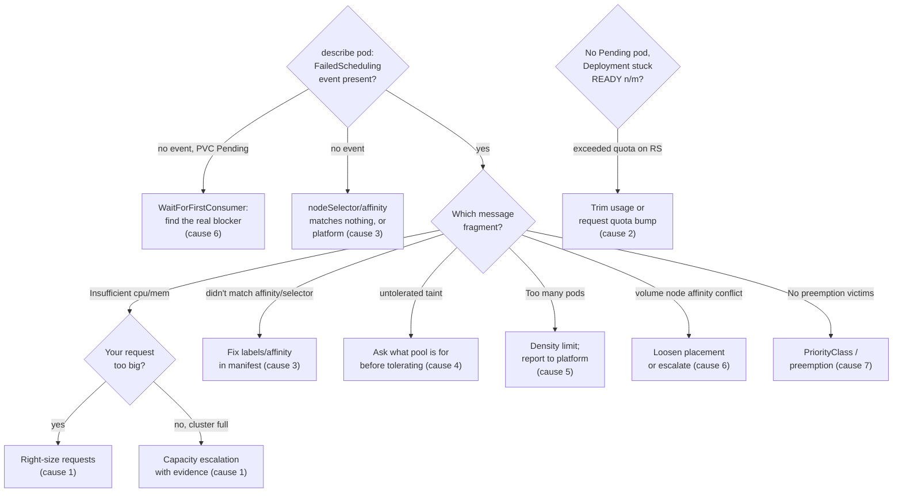

**Symptom:** a pod sits in `Pending` and never starts. No container, no logs, no restarts — nothing to debug inside, because there is no inside yet. `Pending` means the scheduler hasn't found a node that can take the pod (or a volume can't be bound).

## Confirm and get the reason

One command gives you the scheduler's own explanation:

```bash
kubectl describe pod <pod> | tail -20
```

```console
Events:
  Type     Reason            Age    From               Message
  ----     ------            ----   ----               -------
  Warning  FailedScheduling  2m14s  default-scheduler  0/12 nodes are available:
    3 Insufficient cpu, 4 node(s) had untolerated taint {dedicated: gpu},
    5 node(s) didn't match Pod's node affinity/selector.
    preemption: 0/12 nodes are available: 12 No preemption victims found.
```

Read it arithmetically: the numbers add up to the node count, and every node is excluded for a stated reason. Your job is to find which exclusion you control. If there's **no event at all**, the pod probably has a `nodeSelector`/affinity nothing matches, is blocked on volume binding (see below), or — rarely — the scheduler itself is unhappy (platform).

## Causes, ranked by likelihood

### 1. Insufficient CPU or memory

`Insufficient cpu` / `Insufficient memory` means no node has enough **unallocated requests** — this is bookkeeping against `requests`, not live usage. A cluster at 20% actual CPU can still refuse your pod if requests are over-provisioned everywhere.

Distinguish two very different situations:

**Your request is too big.** A single pod requesting 8 CPU in a cluster of 4-CPU nodes will never schedule, ever. Check what you're asking for:

```bash
kubectl get pod <pod> -o jsonpath='{range .spec.containers[*]}{.name}: cpu={.resources.requests.cpu} mem={.resources.requests.memory}{"\n"}{end}'
```

Fix: right-size the request to what the app actually needs ([Resources and QoS](/workloads/resources-and-qos/)). Watch for LimitRange defaults injecting requests you never wrote.

**The cluster is genuinely full.** Reasonable request, but every node's allocatable is spoken for. If you can view nodes:

```bash
kubectl describe node <node> | grep -A6 "Allocated resources"
```

```console
Allocated resources:
  Resource           Requests          Limits
  --------           --------          ------
  cpu                3800m (95%)       6200m (155%)
  memory             14Gi (92%)        22Gi (145%)
```

95% requested across the board = capacity problem. That's a platform escalation ("we need headroom / a node group bump"), not a manifest fix. Attach the FailedScheduling message and your per-pod requests.

### 2. ResourceQuota exceeded

Quota violations usually don't leave a Pending pod — the ReplicaSet fails to *create* pods at all. Symptom: Deployment shows `READY 2/5` and no Pending pods exist.

```bash
kubectl describe quota -n <ns>
kubectl describe rs <replicaset>   # look for "exceeded quota" in events
```

```console
Warning  FailedCreate  35s  replicaset-controller  Error creating: pods "api-7d4b9c6f8-" is
forbidden: exceeded quota: team-quota, requested: requests.memory=2Gi,
used: requests.memory=15Gi, limited: requests.memory=16Gi
```

Fix: free quota (scale something down, lower requests) or ask platform for more, with numbers.

### 3. Node affinity / nodeSelector doesn't match

`node(s) didn't match Pod's node affinity/selector` — your pod demands labels no (available) node has. Typo'd label values are the classic: `disktype: sdd` instead of `ssd`, or an environment label that exists in staging but not prod.

```bash
kubectl get pod <pod> -o jsonpath='{.spec.nodeSelector}{"\n"}{.spec.affinity}' | head
kubectl get nodes --show-labels | grep -i <the-label>   # if you can list nodes
```

Also check `podAntiAffinity`: `topologyKey: kubernetes.io/hostname` with `requiredDuringScheduling` and 6 replicas on a 5-node cluster leaves one pod Pending forever. Prefer `preferredDuringScheduling` unless hard spreading is a real requirement ([High Availability](/workloads/high-availability/)).

### 4. Untolerated taint

`node(s) had untolerated taint {dedicated: gpu}` — those nodes are reserved for workloads that carry a matching toleration. Two readings:

- The taint names something irrelevant to you (`gpu`, `spot`, control-plane): fine, those nodes were never yours. The problem is whichever *other* line excludes the remaining nodes.
- Every node in your intended pool is tainted, or a new taint appeared cluster-wide (e.g. `node.kubernetes.io/disk-pressure`): that's node health or a policy change — platform territory, see [Node Problems](/troubleshooting/node-problems/).

Only add a toleration if the platform team tells you that pool is meant for you. The full mechanics behind these two exclusion lines — affinity, taints/tolerations, and topology spread — are in [Scheduling](/workloads/scheduling/).

### 5. Too many pods

`Too many pods` — nodes have a max pod count (often 110) independent of CPU/memory. Common on clusters full of tiny pods. You can't fix density; report it to platform.

### 6. Volume problems

Two distinct flavors:

**`volume node affinity conflict`** — your PV lives in one zone (topology-bound, common with local or zonal disks) but the only schedulable nodes are in another. Frequent after scale-downs or when affinity pins you away from the volume's zone. Fix: loosen your pod's placement constraints, or escalate — the volume can't move.

**WaitForFirstConsumer chicken-and-egg** — with `volumeBindingMode: WaitForFirstConsumer`, the PVC stays `Pending` *until* a pod is scheduled, and the pod event says:

```console
Warning  FailedScheduling  10s  default-scheduler  0/12 nodes are available:
  pod has unbound immediate PersistentVolumeClaims. (repeated 3 times)
```

or `waiting for first consumer to be created before binding`. A `Pending` PVC here is **normal** and not the fault. The real blocker is whatever else prevents the pod from scheduling — or the StorageClass genuinely can't provision (check `kubectl describe pvc` for provisioner errors). Details in [Storage: PV and PVC](/stateful/storage-pv-pvc/).

```bash
kubectl get pvc
kubectl describe pvc <claim>    # provisioning errors show here
```

### 7. Preemption and PriorityClass

The tail of the FailedScheduling message tells you whether the scheduler considered evicting lower-priority pods to fit yours: `No preemption victims found` means everything running is your priority or higher. If your pod carries no `priorityClassName`, it's default priority — and *your* pods can conversely be preempted by higher-priority workloads (they'll show as deleted with a preemption event). If a class like `high-priority` exists for your use:

```bash
kubectl get priorityclasses
```

Whether you're allowed to use one is a platform policy question.

## Decision table



| Message fragment | Owner | Fix |
|---|---|---|
| `Insufficient cpu/memory` + your request is large | You | Lower requests |
| `Insufficient cpu/memory` + requests reasonable | Platform | Capacity request with evidence |
| `exceeded quota` (on the ReplicaSet) | You/Platform | Trim usage or request a quota bump |
| `didn't match ... affinity/selector` | You | Fix labels/affinity in your manifest |
| `untolerated taint` (dedicated pools) | Depends | Ask what the pool is for before tolerating |
| `untolerated taint` (`disk-pressure` etc.) | Platform | Node health escalation |
| `Too many pods` | Platform | Report |
| `volume node affinity conflict` | You/Platform | Loosen placement or escalate |
| PVC `Pending` with WaitForFirstConsumer | Nobody yet | Find the real scheduling blocker |

:::caution[Don't delete-and-pray]
Deleting a Pending pod gets you an identical Pending pod. Nothing about the pod is broken — the constraint is. Fix the constraint.
:::

## Prevention

- Set requests from measured usage, not vibes — [Resources and QoS](/workloads/resources-and-qos/).
- Use `preferred` affinity/anti-affinity unless you truly need `required`.
- Alert on pods Pending > 5 minutes; a Pending pod during a rollout with `maxUnavailable: 0` silently stalls the whole deploy.
- Know your namespace quota *before* you scale up: `kubectl describe quota`.
